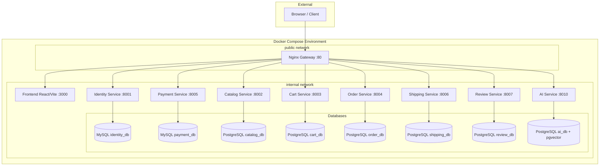
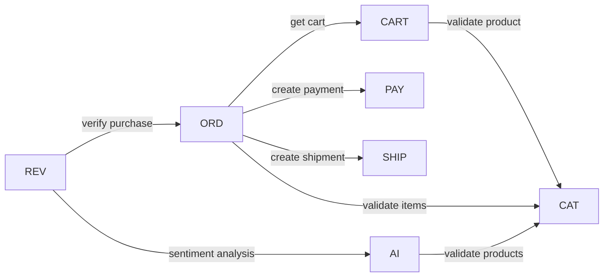
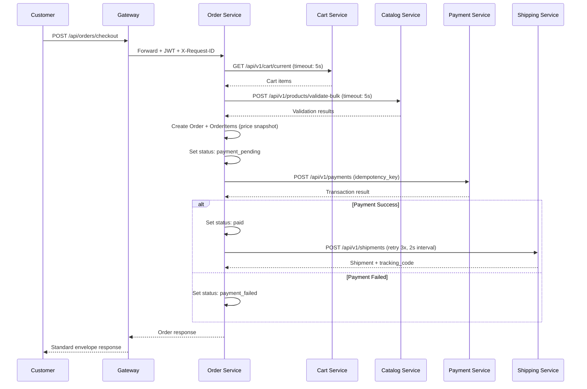
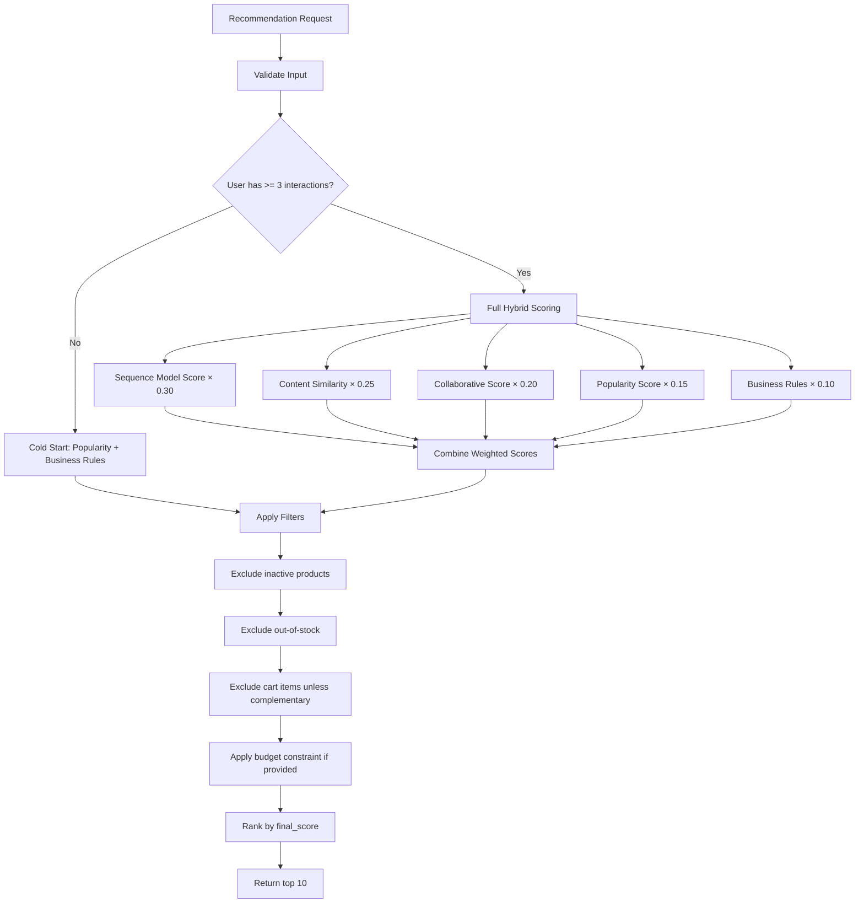
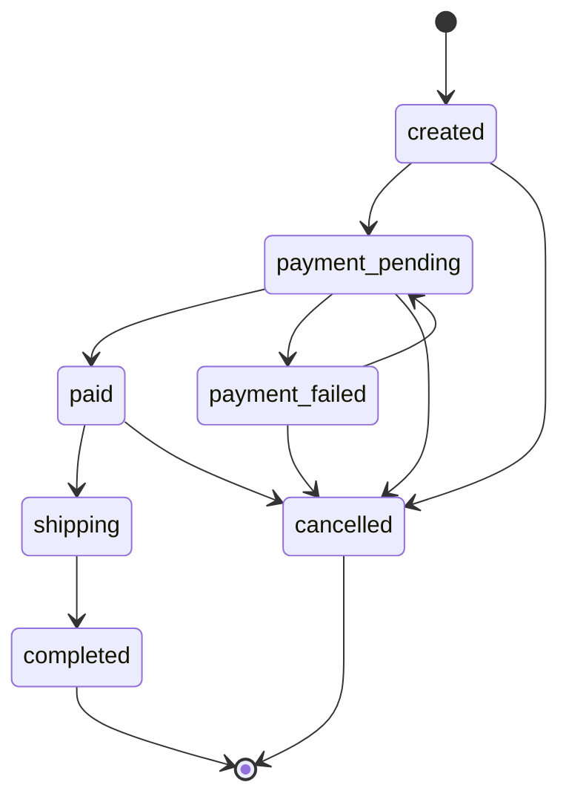
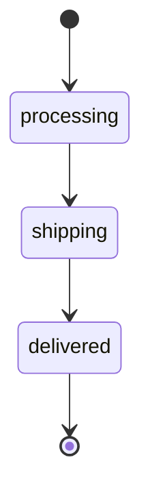
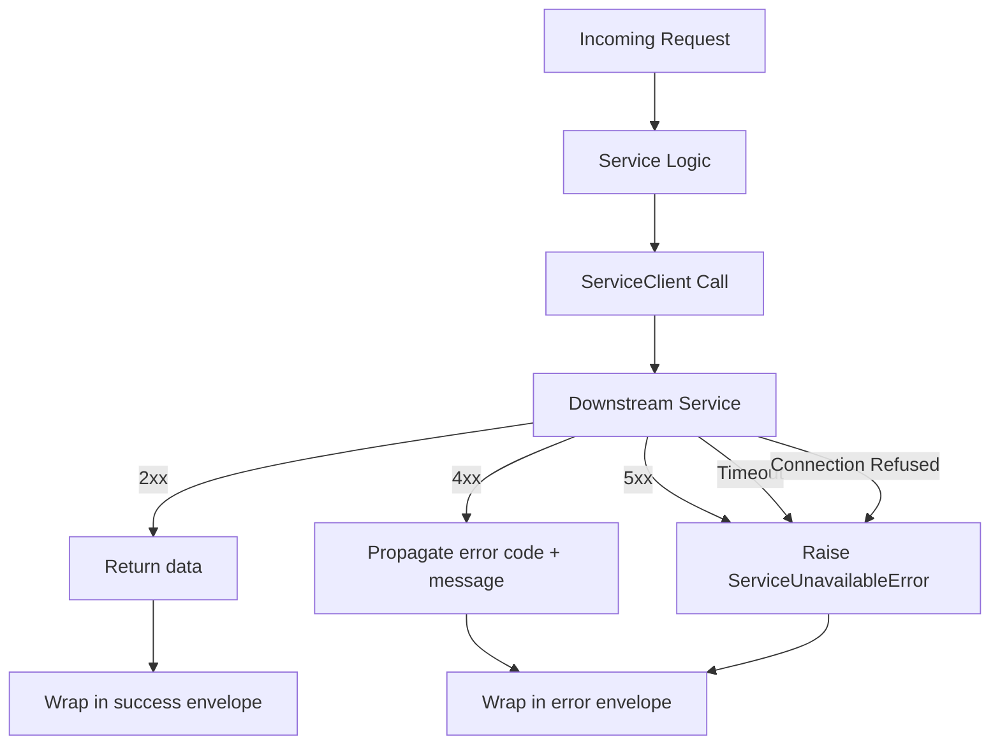

# Design Document: TechShop E-Commerce Platform

## Overview

TechShop is a microservices-based e-commerce platform for technology products, combining Django REST Framework business services with AI/ML capabilities. The system implements the complete customer purchase journey (browse → search → AI chat → cart → checkout → payment → shipping → review) alongside admin management and 5 AI models (RAG chatbot, recommendations, sentiment analysis, customer segmentation, product classification).

The architecture follows Domain-Driven Design with strict service boundaries: 8 backend services, each owning its database, communicating via synchronous REST through a shared ServiceClient wrapper. An Nginx gateway provides the single entry point, routing to services on an internal Docker network. The React/Vite frontend consumes the unified API surface.

### Key Design Decisions

| Decision | Choice | Rationale |
|----------|--------|-----------|
| Service framework | Django REST Framework (business), FastAPI (AI) | Course requirement + FastAPI's async advantage for ML inference |
| Database strategy | Database-per-service (2 MySQL + 6 PostgreSQL) | Strict bounded contexts, course requirement for both engines |
| Vector storage | PostgreSQL + pgvector | Avoids external vector DB, keeps infrastructure simple |
| Communication | Synchronous REST via ServiceClient | Simpler to implement and demo; async documented as extension |
| Gateway | Nginx | Lightweight, handles routing + header injection + body limits |
| Auth | JWT with shared public key validation | Stateless, no callback to Identity_Service needed |
| Checkout | Orchestration pattern (Order_Service coordinates) | Clear workflow, easier debugging |

## Architecture

### System Architecture Diagram



### Inter-Service Communication Flow



### Request Flow

1. Browser sends request to Nginx Gateway (port 80)
2. Gateway injects `X-Request-ID` header, forwards `Authorization` header
3. Gateway routes to appropriate service based on URL prefix
4. Service validates JWT using shared public key (no callback)
5. Service processes request, making inter-service calls via ServiceClient if needed
6. ServiceClient propagates `Authorization` and `X-Request-ID` on outgoing calls
7. Response wrapped in standard envelope with `request_id` in meta

### Checkout Orchestration Sequence



## Components and Interfaces

### Service Layer Architecture (per Django service)

Each business service follows a layered architecture:

```
views.py          → HTTP layer (request/response, no business logic)
serializers.py    → Input validation and output representation
services.py       → Write operations and business workflows
selectors.py      → Read/query operations
repositories.py   → Optional DB abstraction for complex persistence
permissions.py    → RBAC enforcement
models.py         → Database schema definitions
```

### Core Shared Components (apps/core/)

Every Django service includes a `core` app providing:

| Component | Responsibility |
|-----------|---------------|
| `responses.py` | Standard envelope wrapping (success/error) |
| `exceptions.py` | Custom exception classes mapped to error codes |
| `middleware.py` | Request ID generation, structured logging, JWT extraction |
| `pagination.py` | Cursor/page pagination with standard meta format |
| `permissions.py` | Base RBAC permission classes |
| `http_client.py` | ServiceClient wrapper for inter-service calls |

### ServiceClient Interface

```python
class ServiceClient:
    def __init__(self, base_url: str, timeout_seconds: float = 3.0):
        self.base_url = base_url
        self.timeout = timeout_seconds

    def get(self, path: str, *, headers: dict = None, params: dict = None) -> dict:
        """GET with timeout, header propagation, structured logging."""

    def post(self, path: str, *, headers: dict = None, json: dict = None) -> dict:
        """POST with timeout, header propagation, structured logging."""

    def patch(self, path: str, *, headers: dict = None, json: dict = None) -> dict:
        """PATCH with timeout, header propagation, structured logging."""
```

**Behavior:**
- Default timeout: 3 seconds (configurable per instance)
- Propagates `Authorization` and `X-Request-ID` headers automatically
- On 5xx / timeout / connection refused → raises `ServiceUnavailableError`
- On 4xx → propagates downstream error code and message
- Logs: target service, path, status code, duration_ms

### API Endpoint Summary

| Service | Key Endpoints | Auth Required |
|---------|--------------|---------------|
| Identity | `POST /auth/register`, `POST /auth/login`, `POST /auth/refresh` | No (public) |
| Catalog | `GET /products`, `GET /products/{id}`, `POST /products` (admin), `POST /products/import` (admin) | Mixed |
| Cart | `GET /cart/current`, `POST /cart/items`, `PATCH /cart/items/{id}`, `DELETE /cart/items/{id}` | Customer |
| Order | `POST /orders/checkout`, `GET /orders`, `GET /orders/{id}` | Customer/Staff/Admin |
| Payment | `POST /payments`, `POST /payments/{id}/simulate-success`, `POST /payments/{id}/simulate-failure` | Service-to-service / Admin |
| Shipping | `POST /shipments`, `PATCH /shipments/{id}/status`, `GET /shipments/order/{order_id}` | Staff/Customer |
| Review | `POST /reviews`, `GET /reviews/product/{product_id}` | Customer (write) / Public (read) |
| AI | `POST /chat`, `GET /recommendations`, `POST /sentiment`, `POST /segmentation/run`, `POST /classification` | Mixed |

### AI Service Architecture (FastAPI)

```
app/
├── main.py                    → FastAPI app, middleware, routes
├── api/                       → Route handlers
│   ├── chat.py               → RAG chatbot endpoint
│   ├── recommendations.py    → Hybrid recommendation endpoint
│   ├── sentiment.py          → Sentiment analysis endpoint
│   ├── segmentation.py       → Customer segmentation endpoint
│   └── classification.py     → Product classification endpoint
├── core/                      → Config, logging, errors
├── application/               → Business logic services
│   ├── rag_service.py        → RAG pipeline orchestration
│   ├── recommendation_service.py → Hybrid scoring
│   ├── sentiment_service.py  → BERT inference
│   ├── segmentation_service.py → KMeans clustering
│   └── classification_service.py → XGBoost/LightGBM inference
├── infrastructure/            → External integrations
│   ├── db/                   → Database access, pgvector queries
│   ├── llm/                  → LLM client wrapper
│   ├── embeddings/           → Embedding generation
│   └── catalog_client.py     → Catalog service HTTP client
└── ml/                        → Model artifacts and training
    ├── sentiment/            → BERT-family model
    ├── segmentation/         → KMeans model
    ├── sequence_model/       → LSTM/GRU model
    ├── product_classifier/   → XGBoost/LightGBM model
    └── rag/                  → Embedding + retrieval config
```

### Hybrid Recommendation Scoring Pipeline



### Order Status State Machine



### Shipment Status State Machine



## Data Models

### Identity Service (MySQL)

```python
class User:
    id: UUID (PK)
    email: str (unique, max 254)
    password_hash: str
    role: Enum['admin', 'staff', 'customer']  # guest is unauthenticated
    is_active: bool
    failed_login_attempts: int (default 0)
    locked_until: datetime (nullable)
    created_at: datetime
    updated_at: datetime

class RefreshToken:
    id: UUID (PK)
    user_id: UUID (FK -> User)
    token_hash: str (unique)
    expires_at: datetime
    is_revoked: bool (default False)
    created_at: datetime
```

### Catalog Service (PostgreSQL)

```python
class Category:
    id: UUID (PK)
    name: str (max 100)
    slug: str (unique, lowercase + digits + hyphens)
    parent_id: UUID (FK -> Category, nullable)
    is_active: bool (default True)
    level: int (1-3, enforced)
    created_at: datetime

class Product:
    id: UUID (PK)
    sku: str (unique)
    name: str (max 255)
    slug: str (unique)
    description: text (max 5000)
    price: Decimal (0.01 - 999,999,999.99, 2 decimal places)
    stock: int (0 - 999,999)
    brand: str (max 100)
    category_id: UUID (FK -> Category)
    status: Enum['active', 'inactive'] (default 'active')
    attributes: JSONField (nullable)
    rating_avg: Decimal (1 decimal place, default 0.0)
    rating_count: int (default 0)
    created_at: datetime
    updated_at: datetime

class ProductImage:
    id: UUID (PK)
    product_id: UUID (FK -> Product)
    image_url: str (URL)
    is_primary: bool (default False)
    sort_order: int
    # Constraint: exactly one is_primary per product
    # Constraint: max 20 images per product
```

### Cart Service (PostgreSQL)

```python
class Cart:
    id: UUID (PK)
    user_id: UUID (unique)  # one cart per customer
    created_at: datetime
    updated_at: datetime

class CartItem:
    id: UUID (PK)
    cart_id: UUID (FK -> Cart)
    product_id: UUID
    quantity: int (1-99)
    created_at: datetime
    updated_at: datetime
    # Constraint: unique(cart_id, product_id)
```

### Order Service (PostgreSQL)

```python
class Order:
    id: UUID (PK)
    user_id: UUID
    status: Enum['created', 'payment_pending', 'paid', 'payment_failed',
                 'shipping', 'completed', 'cancelled']
    subtotal: Decimal (2 decimal places)
    shipping_fee: Decimal (2 decimal places, default 0.00)
    discount_amount: Decimal (2 decimal places, default 0.00)
    total_amount: Decimal (2 decimal places)
    shipping_address: text
    created_at: datetime
    updated_at: datetime

class OrderItem:
    id: UUID (PK)
    order_id: UUID (FK -> Order)
    product_id: UUID
    product_name: str  # price snapshot
    product_sku: str   # price snapshot
    product_image_url: str  # price snapshot
    unit_price: Decimal (2 decimal places)  # price snapshot
    quantity: int
    line_total: Decimal (2 decimal places)  # unit_price × quantity

class OrderStatusHistory:
    id: UUID (PK)
    order_id: UUID (FK -> Order)
    from_status: str (nullable for initial)
    to_status: str
    reason: str (nullable, max 500)
    created_at: datetime
```

### Payment Service (MySQL)

```python
class PaymentTransaction:
    id: UUID (PK)
    order_id: UUID
    amount: Decimal (2 decimal places)
    status: Enum['pending', 'success', 'failed']
    idempotency_key: str (unique)
    created_at: datetime
    updated_at: datetime

class PaymentStatusHistory:
    id: UUID (PK)
    transaction_id: UUID (FK -> PaymentTransaction)
    from_status: str
    to_status: str
    created_at: datetime
```

### Shipping Service (PostgreSQL)

```python
class Shipment:
    id: UUID (PK)
    order_id: UUID (unique)
    tracking_code: str (unique, 8-20 alphanumeric)
    status: Enum['processing', 'shipping', 'delivered']
    shipping_address: text
    created_at: datetime
    updated_at: datetime

class ShipmentStatusHistory:
    id: UUID (PK)
    shipment_id: UUID (FK -> Shipment)
    from_status: str
    to_status: str
    created_at: datetime
```

### Review Service (PostgreSQL)

```python
class Review:
    id: UUID (PK)
    user_id: UUID
    product_id: UUID
    rating: int (1-5)
    comment: text (1-2000 characters)
    sentiment_label: Enum['positive', 'neutral', 'negative'] (nullable)
    sentiment_score: Decimal (0.0-1.0, nullable)
    sentiment_status: Enum['completed', 'pending'] (default 'pending')
    created_at: datetime
    # Constraint: unique(user_id, product_id)
```

### AI Service (PostgreSQL + pgvector)

```python
class EmbeddingDocument:
    id: UUID (PK)
    source_type: Enum['product', 'faq', 'policy']
    source_id: str  # product_id or document slug
    title: str
    content: text
    embedding: vector(768)  # pgvector column
    metadata: JSONField
    created_at: datetime
    updated_at: datetime

class ChatLog:
    id: UUID (PK)
    user_id: UUID (nullable for guests)
    session_id: str
    message: text
    response: text
    recommended_product_ids: JSONField
    grounded: bool
    hallucination_risk: Enum['low', 'medium', 'high']
    created_at: datetime

class CustomerSegment:
    id: UUID (PK)
    user_id: UUID
    segment_id: int
    segment_name: str
    recency_days: int
    frequency: int
    monetary: Decimal
    run_id: UUID  # links to segmentation run
    created_at: datetime

class SegmentationRun:
    id: UUID (PK)
    num_customers: int
    num_clusters: int
    silhouette_score: Decimal
    created_at: datetime

class UserInteraction:
    id: UUID (PK)
    user_id: UUID
    product_id: UUID
    event_type: Enum['view', 'add_to_cart', 'purchase']
    timestamp: datetime

class ProductClassification:
    id: UUID (PK)
    product_id: UUID
    predicted_category_id: UUID
    predicted_category_label: str
    confidence_score: Decimal (0.0-1.0)
    status: Enum['auto_assigned', 'review_needed']
    created_at: datetime

class RecommendationLog:
    id: UUID (PK)
    user_id: UUID
    context_product_id: UUID (nullable)
    recommended_product_ids: JSONField
    scores: JSONField
    created_at: datetime
```

## Correctness Properties

*A property is a characteristic or behavior that should hold true across all valid executions of a system — essentially, a formal statement about what the system should do. Properties serve as the bridge between human-readable specifications and machine-verifiable correctness guarantees.*

### Property 1: Registration Input Validation

*For any* string that does not conform to valid email format (max 254 chars) or any password outside the 8–128 character range, the Identity_Service registration endpoint SHALL reject the request with a VALIDATION_ERROR and not create a user account.

**Validates: Requirements 1.4, 1.5**

### Property 2: Password Hashing Integrity

*For any* valid password submitted during registration, the stored password_hash SHALL NOT equal the plaintext password, and Django's `check_password(plaintext, hash)` SHALL return True.

**Validates: Requirements 1.3**

### Property 3: JWT Token Expiration Correctness

*For any* successful login, the issued access token SHALL contain an `exp` claim exactly 15 minutes from issuance, and the refresh token SHALL have an expiration of 7 days from issuance.

**Validates: Requirements 2.1**

### Property 4: Refresh Token Rotation

*For any* valid refresh token, calling the refresh endpoint SHALL return a new access token and a new refresh token, and the previously used refresh token SHALL become invalid (subsequent use returns UNAUTHORIZED).

**Validates: Requirements 2.3**

### Property 5: Authentication and Authorization Enforcement

*For any* request to a protected endpoint: (a) if the token is missing, expired, malformed, or has an invalid signature, the response SHALL be 401 UNAUTHORIZED; (b) if the token is valid but the role is insufficient for the endpoint, the response SHALL be 403 FORBIDDEN.

**Validates: Requirements 3.2, 3.4**

### Property 6: Product Validation Correctness

*For any* product creation request, if all fields are within valid ranges (name 1–255 chars, description 1–5000 chars, price 0.01–999,999,999.99, stock 0–999,999, brand 1–100 chars, at least one image URL), the product SHALL be created successfully; if any field is outside its valid range or missing, the request SHALL be rejected with VALIDATION_ERROR indicating which fields failed.

**Validates: Requirements 4.1, 4.2**

### Property 7: Product Import Idempotency

*For any* product with a given SKU, importing it when that SKU already exists in the database SHALL update the existing product's fields rather than creating a duplicate entry, and the total product count for that SKU SHALL remain exactly 1.

**Validates: Requirements 4.8**

### Property 8: Category Slug Generation

*For any* valid category name (1–100 characters), the generated slug SHALL contain only lowercase letters, digits, and hyphens, and SHALL be deterministically derived from the name.

**Validates: Requirements 6.2**

### Property 9: Category Depth Constraint

*For any* category creation with a parent reference, the resulting category depth SHALL not exceed 3 levels. Attempts to create a category at level 4 or deeper SHALL be rejected with VALIDATION_ERROR.

**Validates: Requirements 6.1**

### Property 10: Cart Stock Validation

*For any* product with available stock S and a cart add/update request with quantity Q: the operation SHALL succeed if and only if the product is active AND 1 ≤ Q ≤ 99 AND Q ≤ S. Otherwise, the cart SHALL remain unmodified and an appropriate error (PRODUCT_OUT_OF_STOCK or VALIDATION_ERROR) SHALL be returned.

**Validates: Requirements 7.1, 7.4, 7.5**

### Property 11: Cart Arithmetic Invariant

*For any* cart containing items, each item's `line_total` SHALL equal `unit_price × quantity`, and the cart `subtotal` SHALL equal the sum of all `line_total` values.

**Validates: Requirements 7.7**

### Property 12: Order Total Calculation

*For any* order, `total_amount` SHALL equal `subtotal + shipping_fee - discount_amount`, where subtotal equals the sum of all order item `line_total` values (each being `unit_price × quantity`), and all values SHALL be stored as decimals with exactly two decimal places.

**Validates: Requirements 8.6**

### Property 13: Order Status Transition Correctness

*For any* order in status S and any attempted transition to status T: the transition SHALL succeed if and only if (S, T) is in the allowed transitions map {created→{payment_pending, cancelled}, payment_pending→{paid, payment_failed, cancelled}, paid→{shipping, cancelled}, shipping→{completed}, payment_failed→{payment_pending, cancelled}}. Invalid transitions SHALL return VALIDATION_ERROR without modifying the order.

**Validates: Requirements 23.2, 23.4**

### Property 14: Payment Idempotency

*For any* payment request with a given idempotency_key and order_id, submitting the request multiple times SHALL always return the same transaction result and SHALL never create more than one PaymentTransaction record for that idempotency_key.

**Validates: Requirements 9.6**

### Property 15: Shipment Status Transition Correctness

*For any* shipment in status S and any attempted transition to status T: the transition SHALL succeed if and only if (S, T) is in {(processing, shipping), (shipping, delivered)}. All other transitions SHALL be rejected with VALIDATION_ERROR.

**Validates: Requirements 10.3, 10.5**

### Property 16: Shipment Tracking Code Format

*For any* newly created shipment, the generated tracking_code SHALL be between 8 and 20 characters in length and SHALL contain only alphanumeric characters (matching pattern `^[A-Za-z0-9]{8,20}$`).

**Validates: Requirements 10.2**

### Property 17: Review Uniqueness Constraint

*For any* customer and product combination where a review already exists, attempting to submit a second review SHALL return a CONFLICT error response and SHALL NOT create a duplicate review record.

**Validates: Requirements 11.3**

### Property 18: RAG Cosine Similarity Threshold

*For any* chat query where all retrieved documents have cosine similarity scores below 0.5, the AI_Service SHALL return an AI_NO_CONTEXT_FOUND error response rather than generating an ungrounded answer.

**Validates: Requirements 12.3**

### Property 19: Hybrid Recommendation Score Formula

*For any* set of component scores (sequence, content, collaborative, popularity, business), the final recommendation score SHALL equal `0.30 × sequence + 0.25 × content + 0.20 × collaborative + 0.15 × popularity + 0.10 × business`, and the result SHALL be between 0.0 and 1.0.

**Validates: Requirements 13.2**

### Property 20: Cold Start Recommendation Fallback

*For any* user with fewer than 3 recorded product interactions, the recommendation response SHALL use only popularity_rating_score and business_rule_score components (effective weights: popularity and business only), excluding sequence_model and collaborative_behavior scoring.

**Validates: Requirements 13.6**

### Property 21: Sentiment Output Validity

*For any* non-empty review text of 1–5000 characters, the sentiment analysis response SHALL contain a label that is exactly one of {positive, neutral, negative} and a confidence score that is a decimal value in the range [0.0, 1.0].

**Validates: Requirements 14.1**

### Property 22: ServiceClient Error Classification

*For any* downstream HTTP response: (a) if status code is 5xx, timeout, or connection refused, the ServiceClient SHALL raise a SERVICE_UNAVAILABLE error; (b) if status code is 4xx, the ServiceClient SHALL propagate the downstream error code and message without converting it to SERVICE_UNAVAILABLE.

**Validates: Requirements 18.3, 18.6**

### Property 23: ServiceClient Header Propagation

*For any* inter-service call made through the ServiceClient, the outgoing HTTP request SHALL contain the `Authorization` header and `X-Request-ID` header from the original incoming request context.

**Validates: Requirements 18.2**

### Property 24: API Response Format Correctness

*For any* API response from the platform: (a) successful responses SHALL have `success: true`, a `data` field, and `meta.request_id`; (b) error responses SHALL have `success: false`, `error.code`, `error.message`, and `meta.request_id`; (c) the HTTP status code SHALL match the error code mapping (UNAUTHORIZED→401, FORBIDDEN→403, NOT_FOUND→404, VALIDATION_ERROR→422, PRODUCT_OUT_OF_STOCK→422, PAYMENT_FAILED→502, SERVICE_UNAVAILABLE→503).

**Validates: Requirements 19.1, 19.2, 19.7**

### Property 25: Pagination Metadata Correctness

*For any* paginated list endpoint with N total items and requested page_size P (default 20, max 100), the response SHALL contain `total = N`, `total_pages = ceil(N / P)`, `page_size = P`, and the `data` array length SHALL be `min(P, N - (page - 1) * P)` for valid pages.

**Validates: Requirements 19.3**

### Property 26: Request ID Generation and Propagation

*For any* incoming request, the platform SHALL include a `request_id` matching the pattern `^req_.+$` in the response `meta` field, and all inter-service calls triggered by that request SHALL carry the same value in the `X-Request-ID` header.

**Validates: Requirements 20.4**

### Property 27: Structured Log Entry Format

*For any* HTTP request processed by any service, the emitted log entry SHALL be a valid single-line JSON object containing all required fields: timestamp (ISO 8601), level (DEBUG|INFO|WARNING|ERROR), service, request_id, user_id (or null), method, path, status_code, and duration_ms.

**Validates: Requirements 20.3**

### Property 28: Owner Verification

*For any* cart, order, or review resource owned by user A, a request from user B (where B ≠ A and B does not have admin/staff role) SHALL return a 403 FORBIDDEN response without disclosing the existence of the resource.

**Validates: Requirements 25.4**

### Property 29: Seeding Command Idempotency

*For any* data seeding command, executing it twice with the same source data SHALL result in the same total record count (no duplicates created), and the command SHALL report the number of records created and skipped.

**Validates: Requirements 24.7**

## Error Handling

### Error Classification Strategy

The platform uses a layered error handling approach where errors are classified, wrapped in the standard envelope, and propagated consistently across all services.

### Error Code Registry

| Error Code | HTTP Status | When Used |
|-----------|-------------|-----------|
| `UNAUTHORIZED` | 401 | Missing/invalid/expired JWT token |
| `FORBIDDEN` | 403 | Valid token but insufficient role or not resource owner |
| `NOT_FOUND` | 404 | Resource does not exist or is inactive |
| `VALIDATION_ERROR` | 422 | Invalid input data, constraint violations, invalid state transitions |
| `CONFLICT` | 409 | Duplicate resource (e.g., second review for same product) |
| `PRODUCT_OUT_OF_STOCK` | 422 | Product inactive or insufficient stock for requested quantity |
| `PAYMENT_FAILED` | 502 | Payment simulation returned failure |
| `SERVICE_UNAVAILABLE` | 503 | Downstream service timeout, 5xx, or connection refused |
| `AI_NO_CONTEXT_FOUND` | 503 | RAG retrieval below similarity threshold |
| `ACCOUNT_LOCKED` | 423 | Too many failed login attempts |

### Error Handling Per Layer

```
┌─────────────────────────────────────────────────────┐
│ View Layer (views.py)                                │
│ - Catches all exceptions via DRF exception handler  │
│ - Maps to standard error envelope                   │
│ - Logs error with request_id                        │
├─────────────────────────────────────────────────────┤
│ Service Layer (services.py)                          │
│ - Raises domain-specific exceptions                 │
│ - ProductOutOfStockError, InvalidTransitionError    │
│ - ServiceUnavailableError (from ServiceClient)      │
├─────────────────────────────────────────────────────┤
│ ServiceClient (http_client.py)                       │
│ - Timeout → ServiceUnavailableError                 │
│ - Connection refused → ServiceUnavailableError      │
│ - 5xx response → ServiceUnavailableError            │
│ - 4xx response → propagate downstream error         │
├─────────────────────────────────────────────────────┤
│ Serializer Layer (serializers.py)                    │
│ - Raises ValidationError with field-level details   │
│ - Automatically mapped to VALIDATION_ERROR          │
└─────────────────────────────────────────────────────┘
```

### Custom Exception Hierarchy

```python
class TechShopException(Exception):
    """Base exception for all TechShop services."""
    error_code: str
    http_status: int
    message: str

class ValidationError(TechShopException):
    error_code = "VALIDATION_ERROR"
    http_status = 422
    details: list[dict]  # [{field, reason}]

class NotFoundError(TechShopException):
    error_code = "NOT_FOUND"
    http_status = 404

class ForbiddenError(TechShopException):
    error_code = "FORBIDDEN"
    http_status = 403

class UnauthorizedError(TechShopException):
    error_code = "UNAUTHORIZED"
    http_status = 401

class ProductOutOfStockError(TechShopException):
    error_code = "PRODUCT_OUT_OF_STOCK"
    http_status = 422

class ServiceUnavailableError(TechShopException):
    error_code = "SERVICE_UNAVAILABLE"
    http_status = 503

class InvalidTransitionError(ValidationError):
    """Raised when an invalid state transition is attempted."""

class PaymentFailedError(TechShopException):
    error_code = "PAYMENT_FAILED"
    http_status = 502

class ConflictError(TechShopException):
    error_code = "CONFLICT"
    http_status = 409
```

### Inter-Service Error Propagation



### Retry Strategy

| Scenario | Retry Policy | Rationale |
|----------|-------------|-----------|
| Shipment creation after payment | 3 retries, 2s interval | Requirement 10.6 — order stays "paid" until shipment succeeds |
| All other ServiceClient calls | No automatic retry | Requirement 18.7 — calling service decides retry policy |
| DummyJSON product import | No retry (abort on failure) | Requirement 4.7 — import is admin-triggered, can be re-run |

### Gateway Error Handling

- Request body > 20MB → 413 Payload Too Large (Requirement 25.6)
- No matching route → 404
- Backend timeout → 504 Gateway Timeout
- Backend connection refused → 502 Bad Gateway

## Testing Strategy

### Dual Testing Approach

The platform uses both unit/integration tests and property-based tests for comprehensive coverage:

| Test Type | Purpose | Tools |
|-----------|---------|-------|
| Property-based tests | Verify universal properties across generated inputs | `hypothesis` (Python) |
| Unit tests | Verify specific examples, edge cases, error paths | `pytest` + Django test client |
| Integration tests | Verify inter-service workflows end-to-end | `pytest` + Docker Compose |
| API contract tests | Verify response envelope and pagination format | `pytest` + schema validation |

### Property-Based Testing Configuration

- **Library**: [Hypothesis](https://hypothesis.readthedocs.io/) for Python
- **Minimum iterations**: 100 per property test
- **Tag format**: `# Feature: techshop-ecommerce-platform, Property {N}: {title}`

### Property Test Mapping

| Property | Service Under Test | Key Generators |
|----------|-------------------|----------------|
| P1: Registration Input Validation | identity-service | Random strings (emails, passwords at boundary lengths) |
| P2: Password Hashing Integrity | identity-service | Random valid passwords (8-128 chars) |
| P3: JWT Token Expiration | identity-service | Random registered users |
| P4: Refresh Token Rotation | identity-service | Random valid refresh tokens |
| P5: Auth Enforcement | All services | Random tokens (valid/invalid/expired/malformed) × endpoints |
| P6: Product Validation | catalog-service | Random product data (valid/invalid field combinations) |
| P7: Product Import Idempotency | catalog-service | Random products with fixed SKUs |
| P8: Category Slug Generation | catalog-service | Random category names (unicode, special chars) |
| P9: Category Depth Constraint | catalog-service | Random category trees of varying depth |
| P10: Cart Stock Validation | cart-service | Random (product_stock, requested_quantity) pairs |
| P11: Cart Arithmetic | cart-service | Random cart items with prices and quantities |
| P12: Order Total Calculation | order-service | Random (subtotal, shipping_fee, discount) tuples |
| P13: Order Status Transitions | order-service | Random (current_status, target_status) pairs |
| P14: Payment Idempotency | payment-service | Random payment requests with repeated idempotency keys |
| P15: Shipment Status Transitions | shipping-service | Random (current_status, target_status) pairs |
| P16: Tracking Code Format | shipping-service | Random shipment creation requests |
| P17: Review Uniqueness | review-service | Random (user_id, product_id) pairs with existing reviews |
| P18: RAG Similarity Threshold | ai-service | Random queries with controlled similarity scores |
| P19: Hybrid Score Formula | ai-service | Random component score tuples |
| P20: Cold Start Fallback | ai-service | Random users with 0-2 interactions |
| P21: Sentiment Output Validity | ai-service | Random review texts (1-5000 chars) |
| P22: ServiceClient Error Classification | core/http_client | Random HTTP responses (status codes, timeouts) |
| P23: ServiceClient Header Propagation | core/http_client | Random request contexts with headers |
| P24: API Response Format | All services | Random API calls across all endpoints |
| P25: Pagination Metadata | All services | Random (total_items, page, page_size) combinations |
| P26: Request ID Propagation | All services | Random requests through gateway |
| P27: Structured Log Format | All services | Random requests, parse emitted logs |
| P28: Owner Verification | cart/order/review | Random (owner_user, requester_user) pairs |
| P29: Seeding Idempotency | catalog/ai | Random seed data, run command twice |

### Unit Test Coverage Requirements

Each service must include tests for:

| Category | Examples |
|----------|----------|
| Happy path | Successful registration, login, product creation, checkout |
| Auth failures | Missing token, expired token, wrong role |
| Validation failures | Empty fields, out-of-range values, invalid formats |
| State machine | Valid and invalid transitions for orders and shipments |
| Inter-service failures | Downstream timeout, 5xx, connection refused |
| Edge cases | Empty cart checkout, duplicate review, locked account |

### Integration Test Scenarios

| Scenario | Services Involved | Validates |
|----------|-------------------|-----------|
| Full checkout flow | Cart → Catalog → Order → Payment → Shipping | Requirements 7, 8, 9, 10 |
| Review with sentiment | Review → AI (sentiment) | Requirements 11, 14 |
| AI chat grounded response | AI → Catalog (validation) | Requirements 12 |
| Cart stock validation | Cart → Catalog | Requirements 7.1, 7.2, 7.3 |
| Payment retry on failure | Order → Payment (retry) | Requirements 9.5 |
| Shipment creation retry | Order → Shipping (3x retry) | Requirements 10.6 |

### Test Infrastructure

```
services/{service}/tests/
├── conftest.py              → Fixtures, test DB setup
├── test_models.py           → Model constraints, validations
├── test_serializers.py      → Input/output serialization
├── test_api.py              → API endpoint integration
├── test_services.py         → Business logic unit tests
├── test_properties.py       → Property-based tests (hypothesis)
└── test_permissions.py      → RBAC enforcement tests
```

### CI Pipeline Test Execution

```bash
# Per-service test execution
pytest services/{service}/tests/ --tb=short -q

# Property tests with explicit settings
pytest services/{service}/tests/test_properties.py \
  --hypothesis-settings=max_examples=100

# Full integration (requires Docker Compose)
pytest tests/integration/ --docker-compose
```
