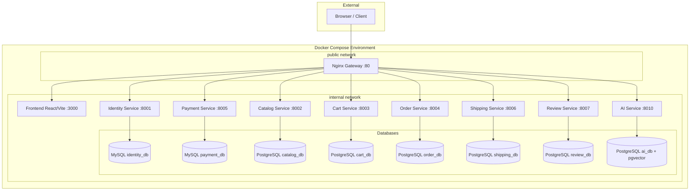
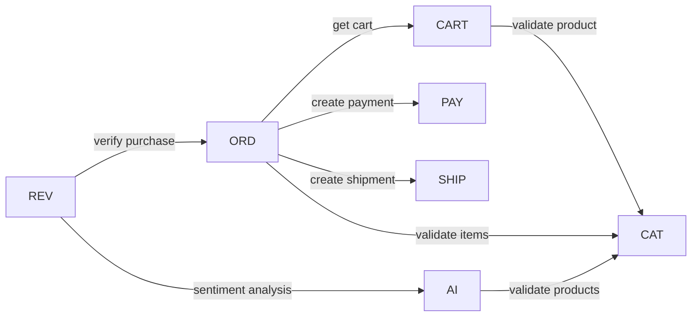
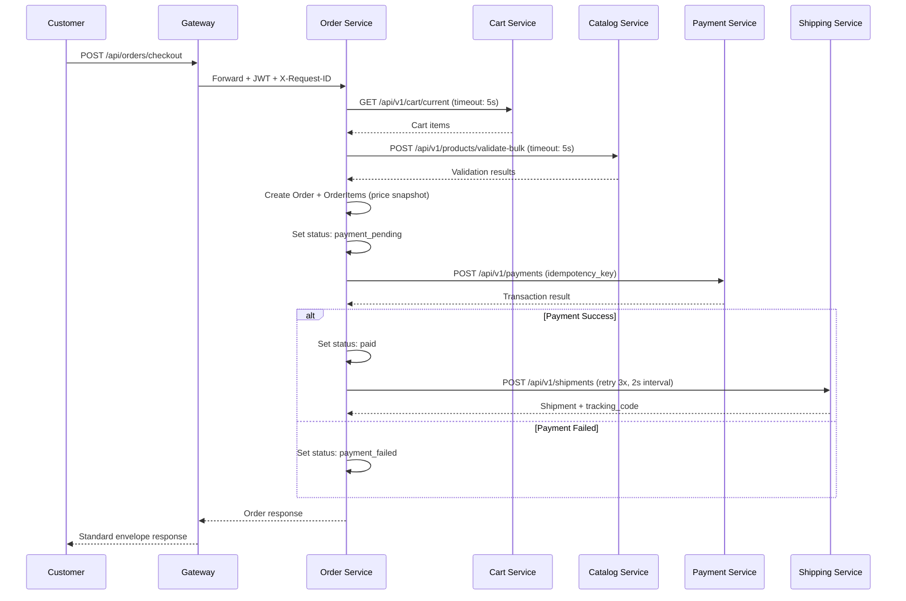
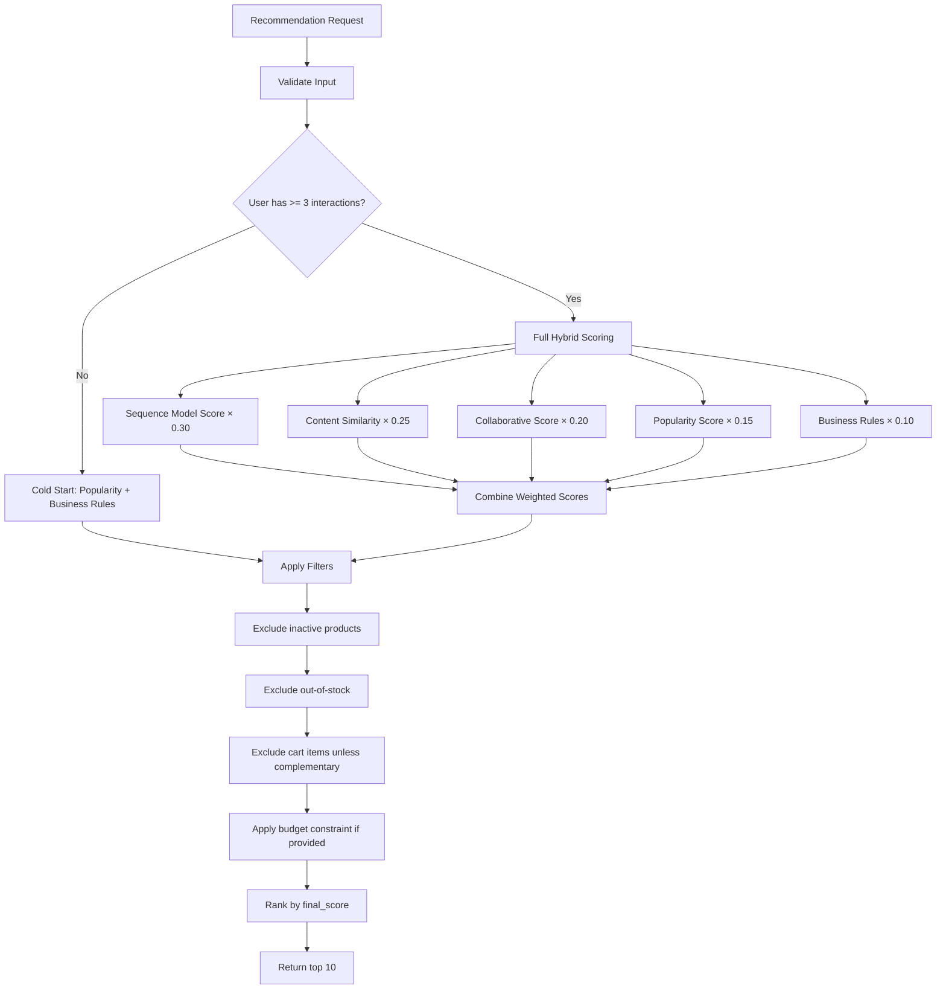
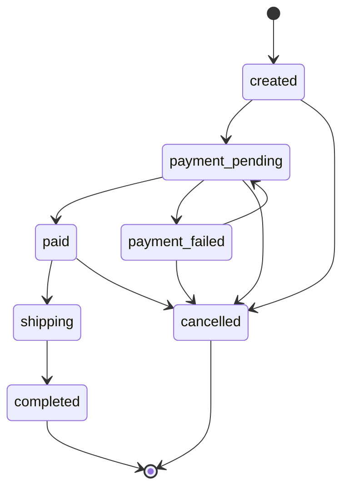
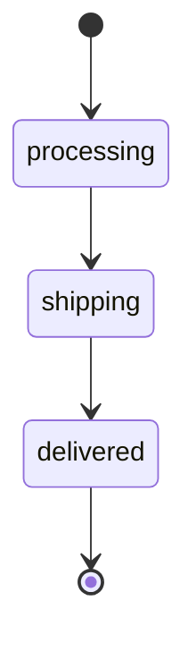

# Design Document: TechShop E-Commerce Platform

## Overview

TechShop is a microservices-based e-commerce platform for technology products, combining Django REST Framework business services with AI/ML capabilities. The system implements the complete customer purchase journey (browse → search → AI chat → cart → checkout → payment → shipping → review) alongside admin management and 5 AI models (RAG chatbot, recommendations, sentiment analysis, customer segmentation, product classification).

The architecture follows Domain-Driven Design with strict service boundaries: 8 backend services, each owning its database, communicating via synchronous REST through a shared ServiceClient wrapper. An Nginx gateway provides the single entry point, routing to services on an internal Docker network. The React/Vite frontend consumes the unified API surface.

### Key Design Decisions

| Decision | Choice | Rationale |
|----------|--------|-----------|
| Service framework | Django REST Framework (business), FastAPI (AI) | Course requirement + FastAPI's async advantage for ML inference |
| Database strategy | Database-per-service (2 MySQL + 6 PostgreSQL) | Strict bounded contexts, course requirement for both engines |
| Vector storage | PostgreSQL + pgvector | Avoids external vector DB, keeps infrastructure simple |
| Communication | Synchronous REST via ServiceClient | Simpler to implement and demo; async documented as extension |
| Gateway | Nginx | Lightweight, handles routing + header injection + body limits |
| Auth | JWT with shared public key validation | Stateless, no callback to Identity_Service needed |
| Checkout | Orchestration pattern (Order_Service coordinates) | Clear workflow, easier debugging |

## Architecture

### System Architecture Diagram



### Inter-Service Communication Flow



### Request Flow

1. Browser sends request to Nginx Gateway (port 80)
2. Gateway injects `X-Request-ID` header, forwards `Authorization` header
3. Gateway routes to appropriate service based on URL prefix
4. Service validates JWT using shared public key (no callback)
5. Service processes request, making inter-service calls via ServiceClient if needed
6. ServiceClient propagates `Authorization` and `X-Request-ID` on outgoing calls
7. Response wrapped in standard envelope with `request_id` in meta

### Checkout Orchestration Sequence



## Components and Interfaces

### Service Layer Architecture (per Django service)

Each business service follows a layered architecture:

```
views.py          → HTTP layer (request/response, no business logic)
serializers.py    → Input validation and output representation
services.py       → Write operations and business workflows
selectors.py      → Read/query operations
repositories.py   → Optional DB abstraction for complex persistence
permissions.py    → RBAC enforcement
models.py         → Database schema definitions
```

### Core Shared Components (apps/core/)

Every Django service includes a `core` app providing:

| Component | Responsibility |
|-----------|---------------|
| `responses.py` | Standard envelope wrapping (success/error) |
| `exceptions.py` | Custom exception classes mapped to error codes |
| `middleware.py` | Request ID generation, structured logging, JWT extraction |
| `pagination.py` | Cursor/page pagination with standard meta format |
| `permissions.py` | Base RBAC permission classes |
| `http_client.py` | ServiceClient wrapper for inter-service calls |

### ServiceClient Interface

```python
class ServiceClient:
    def __init__(self, base_url: str, timeout_seconds: float = 3.0):
        self.base_url = base_url
        self.timeout = timeout_seconds

    def get(self, path: str, *, headers: dict = None, params: dict = None) -> dict:
        """GET with timeout, header propagation, structured logging."""

    def post(self, path: str, *, headers: dict = None, json: dict = None) -> dict:
        """POST with timeout, header propagation, structured logging."""

    def patch(self, path: str, *, headers: dict = None, json: dict = None) -> dict:
        """PATCH with timeout, header propagation, structured logging."""
```

**Behavior:**
- Default timeout: 3 seconds (configurable per instance)
- Propagates `Authorization` and `X-Request-ID` headers automatically
- On 5xx / timeout / connection refused → raises `ServiceUnavailableError`
- On 4xx → propagates downstream error code and message
- Logs: target service, path, status code, duration_ms

### API Endpoint Summary

| Service | Key Endpoints | Auth Required |
|---------|--------------|---------------|
| Identity | `POST /auth/register`, `POST /auth/login`, `POST /auth/refresh` | No (public) |
| Catalog | `GET /products`, `GET /products/{id}`, `POST /products` (admin), `POST /products/import` (admin) | Mixed |
| Cart | `GET /cart/current`, `POST /cart/items`, `PATCH /cart/items/{id}`, `DELETE /cart/items/{id}` | Customer |
| Order | `POST /orders/checkout`, `GET /orders`, `GET /orders/{id}` | Customer/Staff/Admin |
| Payment | `POST /payments`, `POST /payments/{id}/simulate-success`, `POST /payments/{id}/simulate-failure` | Service-to-service / Admin |
| Shipping | `POST /shipments`, `PATCH /shipments/{id}/status`, `GET /shipments/order/{order_id}` | Staff/Customer |
| Review | `POST /reviews`, `GET /reviews/product/{product_id}` | Customer (write) / Public (read) |
| AI | `POST /chat`, `GET /recommendations`, `POST /sentiment`, `POST /segmentation/run`, `POST /classification` | Mixed |

### AI Service Architecture (FastAPI)

```
app/
├── main.py                    → FastAPI app, middleware, routes
├── api/                       → Route handlers
│   ├── chat.py               → RAG chatbot endpoint
│   ├── recommendations.py    → Hybrid recommendation endpoint
│   ├── sentiment.py          → Sentiment analysis endpoint
│   ├── segmentation.py       → Customer segmentation endpoint
│   └── classification.py     → Product classification endpoint
├── core/                      → Config, logging, errors
├── application/               → Business logic services
│   ├── rag_service.py        → RAG pipeline orchestration
│   ├── recommendation_service.py → Hybrid scoring
│   ├── sentiment_service.py  → BERT inference
│   ├── segmentation_service.py → KMeans clustering
│   └── classification_service.py → XGBoost/LightGBM inference
├── infrastructure/            → External integrations
│   ├── db/                   → Database access, pgvector queries
│   ├── llm/                  → LLM client wrapper
│   ├── embeddings/           → Embedding generation
│   └── catalog_client.py     → Catalog service HTTP client
└── ml/                        → Model artifacts and training
    ├── sentiment/            → BERT-family model
    ├── segmentation/         → KMeans model
    ├── sequence_model/       → LSTM/GRU model
    ├── product_classifier/   → XGBoost/LightGBM model
    └── rag/                  → Embedding + retrieval config
```

### Hybrid Recommendation Scoring Pipeline



### Order Status State Machine



### Shipment Status State Machine



## Data Models

### Identity Service (MySQL)

```python
class User:
    id: UUID (PK)
    email: str (unique, max 254)
    password_hash: str
    role: Enum['admin', 'staff', 'customer']  # guest is unauthenticated
    is_active: bool
    failed_login_attempts: int (default 0)
    locked_until: datetime (nullable)
    created_at: datetime
    updated_at: datetime

class RefreshToken:
    id: UUID (PK)
    user_id: UUID (FK -> User)
    token_hash: str (unique)
    expires_at: datetime
    is_revoked: bool (default False)
    created_at: datetime
```

### Catalog Service (PostgreSQL)

```python
class Category:
    id: UUID (PK)
    name: str (max 100)
    slug: str (unique, lowercase + digits + hyphens)
    parent_id: UUID (FK -> Category, nullable)
    is_active: bool (default True)
    level: int (1-3, enforced)
    created_at: datetime

class Product:
    id: UUID (PK)
    sku: str (unique)
    name: str (max 255)
    slug: str (unique)
    description: text (max 5000)
    price: Decimal (0.01 - 999,999,999.99, 2 decimal places)
    stock: int (0 - 999,999)
    brand: str (max 100)
    category_id: UUID (FK -> Category)
    status: Enum['active', 'inactive'] (default 'active')
    attributes: JSONField (nullable)
    rating_avg: Decimal (1 decimal place, default 0.0)
    rating_count: int (default 0)
    created_at: datetime
    updated_at: datetime

class ProductImage:
    id: UUID (PK)
    product_id: UUID (FK -> Product)
    image_url: str (URL)
    is_primary: bool (default False)
    sort_order: int
    # Constraint: exactly one is_primary per product
    # Constraint: max 20 images per product
```

### Cart Service (PostgreSQL)

```python
class Cart:
    id: UUID (PK)
    user_id: UUID (unique)  # one cart per customer
    created_at: datetime
    updated_at: datetime

class CartItem:
    id: UUID (PK)
    cart_id: UUID (FK -> Cart)
    product_id: UUID
    quantity: int (1-99)
    created_at: datetime
    updated_at: datetime
    # Constraint: unique(cart_id, product_id)
```

### Order Service (PostgreSQL)

```python
class Order:
    id: UUID (PK)
    user_id: UUID
    status: Enum['created', 'payment_pending', 'paid', 'payment_failed',
                 'shipping', 'completed', 'cancelled']
    subtotal: Decimal (2 decimal places)
    shipping_fee: Decimal (2 decimal places, default 0.00)
    discount_amount: Decimal (2 decimal places, default 0.00)
    total_amount: Decimal (2 decimal places)
    shipping_address: text
    created_at: datetime
    updated_at: datetime

class OrderItem:
    id: UUID (PK)
    order_id: UUID (FK -> Order)
    product_id: UUID
    product_name: str  # price snapshot
    product_sku: str   # price snapshot
    product_image_url: str  # price snapshot
    unit_price: Decimal (2 decimal places)  # price snapshot
    quantity: int
    line_total: Decimal (2 decimal places)  # unit_price × quantity

class OrderStatusHistory:
    id: UUID (PK)
    order_id: UUID (FK -> Order)
    from_status: str (nullable for initial)
    to_status: str
    reason: str (nullable, max 500)
    created_at: datetime
```

### Payment Service (MySQL)

```python
class PaymentTransaction:
    id: UUID (PK)
    order_id: UUID
    amount: Decimal (2 decimal places)
    status: Enum['pending', 'success', 'failed']
    idempotency_key: str (unique)
    created_at: datetime
    updated_at: datetime

class PaymentStatusHistory:
    id: UUID (PK)
    transaction_id: UUID (FK -> PaymentTransaction)
    from_status: str
    to_status: str
    created_at: datetime
```

### Shipping Service (PostgreSQL)

```python
class Shipment:
    id: UUID (PK)
    order_id: UUID (unique)
    tracking_code: str (unique, 8-20 alphanumeric)
    status: Enum['processing', 'shipping', 'delivered']
    shipping_address: text
    created_at: datetime
    updated_at: datetime

class ShipmentStatusHistory:
    id: UUID (PK)
    shipment_id: UUID (FK -> Shipment)
    from_status: str
    to_status: str
    created_at: datetime
```

### Review Service (PostgreSQL)

```python
class Review:
    id: UUID (PK)
    user_id: UUID
    product_id: UUID
    rating: int (1-5)
    comment: text (1-2000 characters)
    sentiment_label: Enum['positive', 'neutral', 'negative'] (nullable)
    sentiment_score: Decimal (0.0-1.0, nullable)
    sentiment_status: Enum['completed', 'pending'] (default 'pending')
    created_at: datetime
    # Constraint: unique(user_id, product_id)
```

### AI Service (PostgreSQL + pgvector)

```python
class EmbeddingDocument:
    id: UUID (PK)
    source_type: Enum['product', 'faq', 'policy']
    source_id: str  # product_id or document slug
    title: str
    content: text
    embedding: vector(768)  # pgvector column
    metadata: JSONField
    created_at: datetime
    updated_at: datetime

class ChatLog:
    id: UUID (PK)
    user_id: UUID (nullable for guests)
    session_id: str
    message: text
    response: text
    recommended_product_ids: JSONField
    grounded: bool
    hallucination_risk: Enum['low', 'medium', 'high']
    created_at: datetime

class CustomerSegment:
    id: UUID (PK)
    user_id: UUID
    segment_id: int
    segment_name: str
    recency_days: int
    frequency: int
    monetary: Decimal
    run_id: UUID  # links to segmentation run
    created_at: datetime

class SegmentationRun:
    id: UUID (PK)
    num_customers: int
    num_clusters: int
    silhouette_score: Decimal
    created_at: datetime

class UserInteraction:
    id: UUID (PK)
    user_id: UUID
    product_id: UUID
    event_type: Enum['view', 'add_to_cart', 'purchase']
    timestamp: datetime

class ProductClassification:
    id: UUID (PK)
    product_id: UUID
    predicted_category_id: UUID
    predicted_category_label: str
    confidence_score: Decimal (0.0-1.0)
    status: Enum['auto_assigned', 'review_needed']
    created_at: datetime

class RecommendationLog:
    id: UUID (PK)
    user_id: UUID
    context_product_id: UUID (nullable)
    recommended_product_ids: JSONField
    scores: JSONField
    created_at: datetime
```


## Correctness Properties

### Property 1: Price Snapshot Immutability

Once an OrderItem is created, its `unit_price`, `product_name`, `product_sku`, and `product_image_url` fields SHALL never be modified, regardless of subsequent changes to the source product in Catalog_Service.

**Validates: Requirements 8.2**

### Property 2: Order Status Transition Validity

An Order's status SHALL only transition through the allowed paths defined in the state machine. Any attempt to perform an invalid transition SHALL be rejected atomically using optimistic locking (WHERE clause on current status).

**Validates: Requirements 23.2, 23.4**

### Property 3: Cart-Product Consistency

A CartItem SHALL only reference a product_id that is active and in-stock at the time of addition. Stock validation occurs via Catalog_Service API call before any cart modification.

**Validates: Requirements 7.1, 7.2**

### Property 4: One Cart Per Customer

The Cart_Service SHALL maintain exactly one active cart per user_id. The unique constraint on `Cart.user_id` enforces this at the database level.

**Validates: Requirements 7.8**

### Property 5: One Review Per Customer Per Product

The unique constraint on `Review(user_id, product_id)` ensures no duplicate reviews exist. Attempting a second review returns a CONFLICT error.

**Validates: Requirements 11.3**

### Property 6: Payment Idempotency

The unique constraint on `PaymentTransaction.idempotency_key` ensures that duplicate payment requests for the same order produce the same result without creating additional transactions.

**Validates: Requirements 9.6**

### Property 7: Shipment Status Forward-Only

Shipment status transitions are strictly forward: processing → shipping → delivered. No backward transitions are permitted. Invalid transitions are rejected with VALIDATION_ERROR.

**Validates: Requirements 10.3, 10.5**

### Property 8: Database Isolation

No service SHALL directly access another service's database. All cross-service data access occurs through REST API calls via ServiceClient. This is enforced by Docker network configuration (services cannot reach other databases).

**Validates: Requirements 18.4**

## Error Handling

### Error Response Envelope

All errors follow the standard envelope format:

```json
{
  "success": false,
  "error": {
    "code": "ERROR_CODE",
    "message": "Human-readable description",
    "details": []
  },
  "meta": {
    "request_id": "req_..."
  }
}
```

### Error Code to HTTP Status Mapping

| Error Code | HTTP Status | When Used |
|-----------|-------------|-----------|
| UNAUTHORIZED | 401 | Missing/invalid/expired JWT token |
| FORBIDDEN | 403 | Valid token but insufficient role or not resource owner |
| NOT_FOUND | 404 | Resource does not exist |
| VALIDATION_ERROR | 422 | Invalid input data, field constraints violated |
| PRODUCT_OUT_OF_STOCK | 422 | Product unavailable for cart/order operations |
| CONFLICT | 409 | Duplicate review, concurrent status transition |
| PAYMENT_FAILED | 502 | Payment processing failure |
| SERVICE_UNAVAILABLE | 503 | Downstream service timeout/unreachable |
| AI_NO_CONTEXT_FOUND | 503 | RAG retrieval insufficient for grounded answer |

### Inter-Service Error Propagation

1. **4xx from downstream**: ServiceClient propagates the error code and message directly to the caller without transformation.
2. **5xx / timeout / connection refused from downstream**: ServiceClient raises `ServiceUnavailableError`, which the calling service maps to a 503 SERVICE_UNAVAILABLE response.
3. **No automatic retries in ServiceClient**: Each service implements its own retry logic where appropriate (e.g., Order_Service retries shipment creation 3 times).

### Graceful Degradation

- **AI_Service unavailable during review submission**: Review_Service stores the review without sentiment data, marks `sentiment_status = 'pending'`, and processes sentiment asynchronously later.
- **Shipping_Service unavailable after payment**: Order_Service retains order in "paid" status and retries shipment creation up to 3 times with 2-second intervals.
- **Catalog_Service unavailable during cart add**: Cart_Service returns SERVICE_UNAVAILABLE immediately without modifying the cart.

## Testing Strategy

### Unit Tests (per service)

Each service SHALL have unit tests covering:

- **Models**: Field validation, constraints, default values
- **Serializers**: Input validation, output format, edge cases
- **Services/Selectors**: Business logic, state transitions, calculations
- **Permissions**: Role-based access control enforcement

### API Integration Tests (per service)

Each service SHALL have API tests covering:

- Happy path for all endpoints
- Authentication/authorization failures
- Validation error responses
- Edge cases (empty cart checkout, duplicate review, invalid status transition)

### Inter-Service Integration Tests

Key cross-service workflows to test:

1. **Checkout flow**: Cart → Order → Payment → Shipping (mock downstream services)
2. **Review with sentiment**: Review → AI sentiment endpoint
3. **Cart stock validation**: Cart → Catalog product validation

### Test Infrastructure

- **Django services**: `pytest` + `pytest-django` + `factory_boy` for fixtures
- **FastAPI AI service**: `pytest` + `httpx` AsyncClient
- **Database**: Each test uses a fresh test database (Django's `TestCase` with transaction rollback)
- **Inter-service mocking**: `responses` library or `unittest.mock.patch` on ServiceClient methods

### Minimum Test Coverage Targets

| Layer | Coverage Target |
|-------|----------------|
| Models | All constraints and custom methods |
| Serializers | Valid/invalid input for each field |
| API endpoints | All status codes documented in error handling |
| Services | All business rules and state transitions |
| Permissions | Each role × each endpoint combination |
