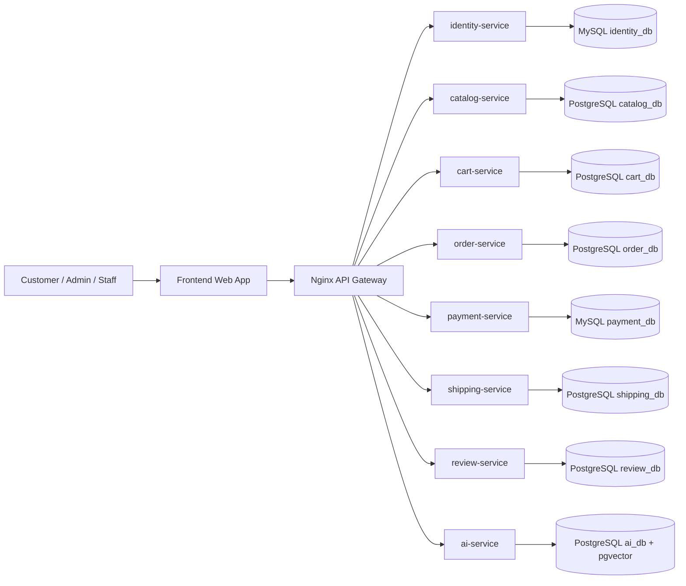
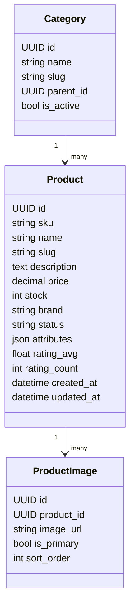
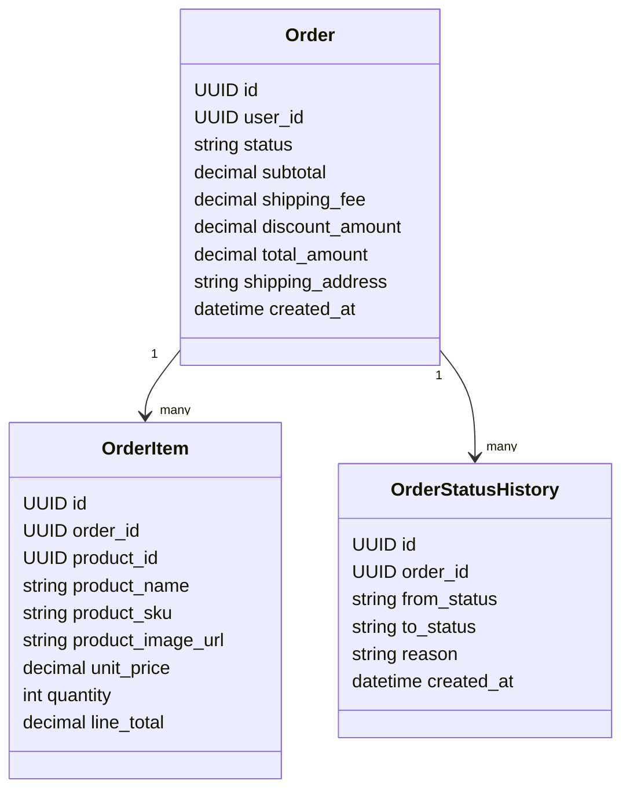
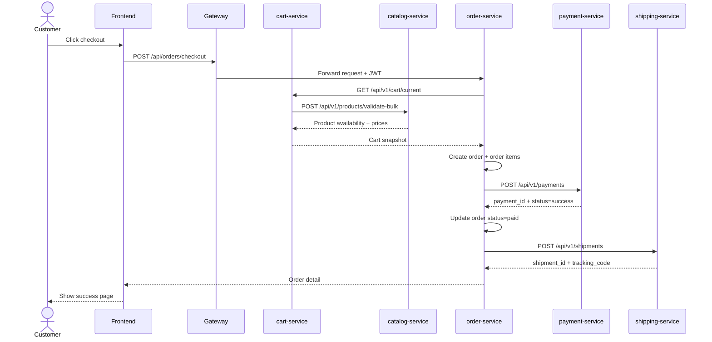
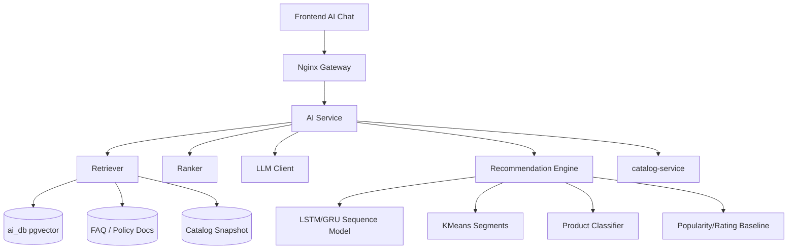
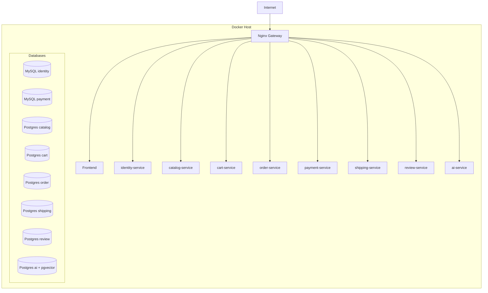

# ARCHITECTURE.md

# TechShop Architecture

## 1. Architectural Style

TechShop dùng **Microservices Architecture** kết hợp **Domain-Driven Design**. Mỗi service đại diện cho một bounded context nghiệp vụ, có database riêng và giao tiếp qua REST API hoặc event.

Principles:

- Database per service.
- High cohesion, loose coupling.
- API-first contracts.
- Stateless application containers.
- Fault isolation.
- Simple enough to complete, realistic enough to defend.

## 2. System Context



## 3. Service Decomposition

### 3.1 identity-service

Owns:

- User
- Role
- Permission
- JWT issuing/refresh

Does not own:

- Cart
- Order
- Payment
- Shipping address history, unless required for profile only

### 3.2 catalog-service

Owns:

- Category
- Product
- ProductImage
- ProductAttribute
- Inventory
- Product import job

Important rule: `order-service` stores product snapshot. It does not rely on live product price after purchase.

### 3.3 cart-service

Owns:

- Cart
- CartItem

References external IDs only:

- `user_id`
- `product_id`

It validates product availability via catalog API.

### 3.4 order-service

Owns:

- Order
- OrderItem
- OrderStatusHistory

Coordinates checkout workflow.

### 3.5 payment-service

Owns:

- PaymentTransaction
- PaymentStatusHistory
- IdempotencyKey

It simulates payment. Do not integrate real money for this project.

### 3.6 shipping-service

Owns:

- Shipment
- ShipmentStatusHistory
- TrackingCode

### 3.7 review-service

Owns:

- Review
- Rating
- SentimentResult snapshot

Calls AI service for sentiment inference.

### 3.8 ai-service

Owns:

- Model metadata
- Embedding documents
- Product embedding vectors
- FAQ/policy documents
- Recommendation logs
- Chat logs
- Customer segments

Does not own canonical product data. It uses catalog snapshot or catalog API.

## 4. Database Allocation

| Service | DB | Engine | Reason |
|---|---|---|---|
| identity-service | identity_db | MySQL | Simple auth data, fulfills MySQL requirement |
| payment-service | payment_db | MySQL | Transaction-like records, fulfills MySQL requirement |
| catalog-service | catalog_db | PostgreSQL | Product JSON attributes, search/filter |
| cart-service | cart_db | PostgreSQL | Cart data and constraints |
| order-service | order_db | PostgreSQL | Order lifecycle, snapshots |
| shipping-service | shipping_db | PostgreSQL | Shipment status history |
| review-service | review_db | PostgreSQL | Review text and sentiment result |
| ai-service | ai_db | PostgreSQL + pgvector | Embeddings, RAG docs, model outputs |

## 5. Core Data Models

### 5.1 Catalog



### 5.2 Order



## 6. Service Communication

### 6.1 Synchronous REST

Used for request/response operations:

- Cart validates product.
- Order reads cart.
- Order creates payment.
- Review calls AI sentiment.
- Frontend calls APIs via gateway.

Rules:

- Every outgoing HTTP call must have timeout.
- Do not call service in loops without batching.
- Propagate `X-Request-ID`.
- Return explicit error codes.

### 6.2 Event-style communication

For this project, full Kafka/RabbitMQ is optional. Use one of these:

Option A — Simple synchronous orchestration:

- `order-service` calls `payment-service`.
- `order-service` calls `shipping-service` after payment success.

Option B — Production-like with Redis/RabbitMQ:

- `OrderCreated`
- `PaymentSucceeded`
- `PaymentFailed`
- `ShipmentCreated`
- `ProductViewed`
- `ReviewCreated`

Recommended for deadline: implement Option A, document Option B as extension.

## 7. Checkout Sequence



## 8. AI Architecture



### 8.1 RAG Pipeline

1. Ingest catalog products + FAQ + policy docs.
2. Normalize text.
3. Chunk documents.
4. Generate embeddings.
5. Store in `ai_db` using pgvector.
6. At query time:
   - Retrieve top-k docs/products.
   - Filter by stock/category/price constraints.
   - Rerank.
   - Generate answer with LLM.
   - Return answer + product IDs + citations/metadata.

### 8.2 AI Endpoint Contracts

#### Chat

```http
POST /api/ai/chat
```

Request:

```json
{
  "user_id": "uuid-or-null",
  "message": "Tôi cần laptop học AI dưới 20 triệu",
  "context": {
    "current_product_id": null,
    "cart_product_ids": []
  }
}
```

Response:

```json
{
  "answer": "Bạn nên cân nhắc 3 mẫu sau...",
  "recommended_product_ids": ["..."],
  "retrieved_documents": [
    {"document_id": "...", "type": "product", "score": 0.82}
  ],
  "safety": {
    "grounded": true,
    "hallucination_risk": "low"
  }
}
```

#### Recommendations

```http
GET /api/ai/recommendations?user_id=...&context_product_id=...
```

Response:

```json
{
  "items": [
    {"product_id": "...", "score": 0.91, "reason": "similar_category_and_high_rating"}
  ]
}
```

#### Sentiment

```http
POST /api/ai/sentiment
```

Response:

```json
{
  "label": "positive",
  "score": 0.94,
  "model_version": "sentiment-mbert-v1"
}
```

## 9. Hybrid Recommendation Score

```txt
final_score =
  0.30 * sequence_score
+ 0.25 * content_similarity_score
+ 0.20 * collaborative_or_behavior_score
+ 0.15 * popularity_rating_score
+ 0.10 * business_rule_score
```

Business filters before ranking:

- Exclude inactive products.
- Exclude out-of-stock products.
- Respect price constraint if user query includes budget.
- Avoid recommending products already in cart unless complementary.

## 10. Auth Architecture

- identity-service issues JWT.
- Gateway forwards `Authorization: Bearer <token>`.
- Each service validates JWT using shared public key or shared secret.
- Services enforce RBAC at endpoint level.

Roles:

| Role | Permissions |
|---|---|
| guest | Browse catalog, use limited chatbot |
| customer | Cart, checkout, review, order tracking |
| staff | Order/shipping management |
| admin | Full catalog/user/dataset/model admin |

## 11. Gateway Routing

```nginx
location /api/auth/ {
    proxy_pass http://identity-service:8000/api/v1/auth/;
}

location /api/catalog/ {
    proxy_pass http://catalog-service:8000/api/v1/;
}

location /api/cart/ {
    proxy_pass http://cart-service:8000/api/v1/;
}

location /api/orders/ {
    proxy_pass http://order-service:8000/api/v1/;
}

location /api/payments/ {
    proxy_pass http://payment-service:8000/api/v1/;
}

location /api/shipping/ {
    proxy_pass http://shipping-service:8000/api/v1/;
}

location /api/reviews/ {
    proxy_pass http://review-service:8000/api/v1/;
}

location /api/ai/ {
    proxy_pass http://ai-service:8000/api/v1/;
}
```

## 12. Observability

Every service must expose:

```txt
GET /healthz
GET /readyz
```

Log fields:

```json
{
  "timestamp": "2026-05-29T10:00:00Z",
  "level": "INFO",
  "service": "catalog-service",
  "request_id": "req_abc",
  "method": "GET",
  "path": "/api/v1/products",
  "status_code": 200,
  "duration_ms": 42
}
```

Metrics for report:

- Request count per service.
- Error rate.
- Average latency.
- AI chat count.
- Recommendation count.
- Orders created.

## 13. Deployment Architecture



## 14. Architecture Decisions

| ADR | Decision | Reason |
|---|---|---|
| ADR-01 | Use Django DRF for business services | Course constraint, fast CRUD/API |
| ADR-02 | Use FastAPI or DRF for AI service | FastAPI better for AI, DRF if strict Django-only |
| ADR-03 | Use PostgreSQL for catalog/order/cart/shipping/review/AI | Better JSON/search/vector extension |
| ADR-04 | Use MySQL for identity/payment | Satisfies exactly 2 MySQL services |
| ADR-05 | Use Nginx as gateway | Simple, aligns with course sample |
| ADR-06 | Use pgvector instead of external vector DB | Keeps DB requirement simple, fewer services |
| ADR-07 | Use synchronous checkout first | Easier to complete and demo |
| ADR-08 | Document async events as extension | Production realism without overbuilding |

## 15. Production Gaps

This project is production-like but not full production. Missing areas:

- Real payment integration.
- Real shipping provider integration.
- Full distributed tracing.
- Centralized secret manager.
- Real autoscaling/Kubernetes.
- Full CI/CD quality gates.
- Real model monitoring and drift detection.

For report, present these as known limitations and future work.

